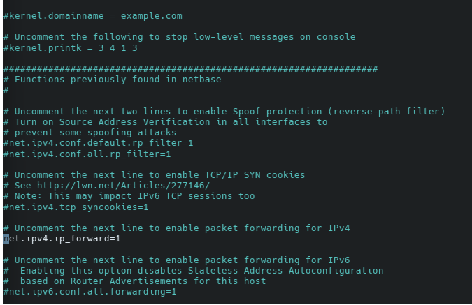
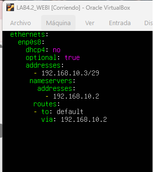
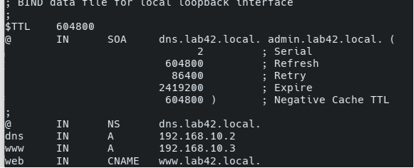
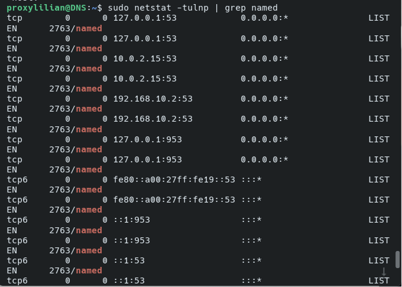
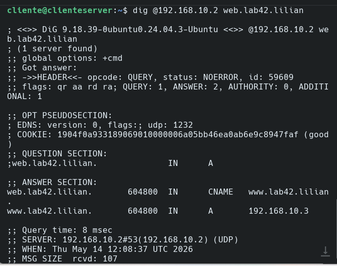
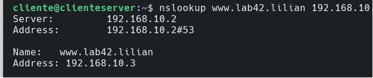

# Informe de Laboratorio: Servidor DNS Primario e Integración Web

**Asignatura:** Infraestructura, Plataformas Tecnologicas y Redes (SIS313) 
**Institución:** Universidad de San Francisco Xavier (USFX)
**Estudiante:** Lilian Ariel Cruz Romero
**Fecha:** 14 de mayo de 2026

## 1. Objetivos
* Configurar un servidor DNS primario bajo el dominio `lab42.lilian`.
* Implementar un servidor web Nginx en una red interna privada.
* Establecer un Gateway (puerta de enlace) con reenvío de paquetes e IPTables para permitir el acceso desde el Host anfitrión.

## 2. Topología de Red

La infraestructura se compone de tres entidades lógicas:
1. **Host Anfitrión (Windows):** Accede mediante `127.0.0.1:8080`.
2. **Servidor DNS/Gateway (Ubuntu/Debian):**
   - Adaptador 1 (NAT): `10.0.2.15`.
   - Adaptador 2 (Red Interna): `192.168.10.2`.
3. **Servidor Web (Linux):**
   - Adaptador 1 (Red Interna): `192.168.10.3`.

## Esquema de la Topología y Flujo de Datos
La arquitectura implementada sigue un modelo de red segmentada donde el servidor DNS actúa como intermediario (Gateway) entre la red externa del anfitrión y la red privada de los servidores.

### Representación de la Red
* **Red Externa (Host Anfitrión):** Windows PC ejecutando el navegador y herramientas de diagnóstico.
* **Red de Gestión (NAT):** Rango `10.0.2.0/24` utilizado para la comunicación entre el Host y el Gateway.
* **Red Interna (LAN Privada):** Rango `192.168.10.0/29` donde residen los servicios de infraestructura.

### Diagrama de Conectividad Lógica
```
      [ PC ANFITRIÓN (Windows) ]
      | IP: 127.0.0.1 (Localhost)
      | Puerto: 8080 (Mapeado)
      v
[ ADAPTADOR NAT (VirtualBox) ] <--- Entrada de tráfico externo
      |
      v [ Interfaz: enp0s3 | IP: 10.0.2.15 ]
+---------------------------------------+
|      SERVIDOR DNS & GATEWAY           |
| (Enrutamiento mediante IPTables)      |
+---------------------------------------+
      | [ Interfaz: enp0s8 | IP: 192.168.10.2 ]
      |
      +------> [ SERVIDOR WEB ]
      |        IP: 192.168.10.3 (Puerto 80)
      |
      +------> [ CLIENTE DE PRUEBAS ]
               IP: 192.168.10.x
```

4. ## Configuración del Servidor DNS (Gateway)
Se habilitó el reenvío de IPv4 editando el archivo `/etc/sysctl.conf` para permitir el paso de tráfico entre las interfaces NAT e Interna.[cite: 1]

```bash
# Comando para activar el forwarding inmediatamente
sudo sysctl -w net.ipv4.ip_forward=1
```
## Reglas IPTables (NAT)
# Redirigir el tráfico que llega al DNS (puerto 80) hacia la VM Web
```
sudo iptables -t nat -A PREROUTING -p tcp --dport 80 -j DNAT --to-destination 192.168.10.3:80
```
# Enmascarar la salida para que la VM Web pueda responder al Host
```
sudo iptables -t nat -A POSTROUTING -j MASQUERADE
```
# Permitir el tráfico de reenvío explícitamente
```
sudo iptables -A FORWARD -p tcp --dport 80 -d 192.168.10.3 -j ACCEPT
```
5. ## Configuracion del Cliente
##Configuracion forward
   
   
## Configuraciones del DNS:

   
   
   

   
## Prubras Grupales e individuales


   

   
## PRUEBAS INDIVIDUALES: 
   


   
   

## Se muestra la pagina web en Linux

   

   
## Se muestra la pagina web en el Anfitrion

   

   
## PRUEBAS GRUPALES
   ## Configuracion DNS

   
   
   
   
   ## Conectividad entre maquinas
   
   
   
   
   
   ## Conectividad con la pagina y linux
   
   
   
   
   
   ## Conectividad con la pagina y la PC Anfitrion
   
   
   


6. ## Conclusiones 
* **Sincronización de Servicios Multivm:** El éxito de la práctica radicó en la capacidad del grupo para coordinar tres máquinas virtuales con roles distintos, logrando que el Servidor DNS actuara como el núcleo de comunicación (Gateway) para la Red Interna privada.
* **Validación del Enrutamiento Dinámico:** Se comprobó que la activación del `ip_forward` en el kernel de Linux es un paso crítico; sin esta configuración, aunque el DNS responda, el tráfico de datos hacia el servidor web se interrumpe en la capa de red.
* **Eficiencia del NAT e IPTables:** La implementación de reglas de traslación de direcciones (NAT) mediante IPTables permitió resolver la limitación física del Host anfitrión, demostrando cómo se puede mapear un puerto externo (8080) hacia un recurso interno (192.168.10.3) de forma transparente para el usuario final.
* **Resolución de Nombres Distribuida:** El grupo validó que la edición del archivo `hosts` en el sistema anfitrión es una técnica fundamental de diagnóstico que permite simular la resolución de nombres antes de desplegar un servicio en una red de producción real.
* **Aprendizaje Colaborativo:** Durante la sesión, el equipo identificó y resolvió errores comunes como la falta de herramientas de red (`netstat`) y conflictos en el reenvío de puertos de VirtualBox, fortaleciendo las habilidades de troubleshooting y administración de servidores Linux en entornos virtuales.
* **Integración Final:** Se logró el objetivo principal de la práctica: integrar exitosamente los servicios de DNS y Web en una arquitectura segmentada, cumpliendo rigurosamente con los requisitos técnicos exigidos por la facultad.
